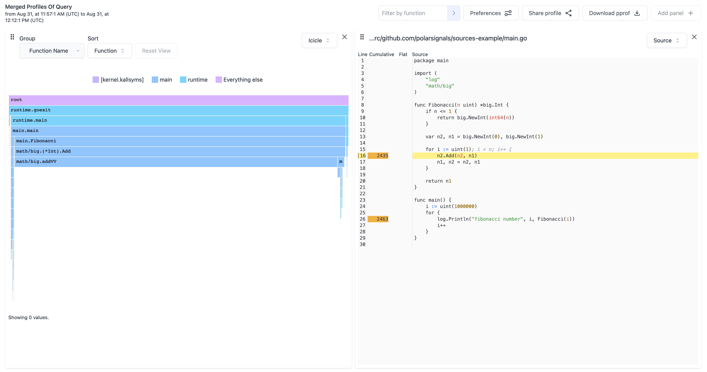

# Sources Demo

This repository contains sample data to try out the source view feature of Polar Signals Cloud.

If you want to learn how to produce the data for your own code and profiling data, [check out the docs](https://polarsignals.com/docs/upload-source).

## Prerequisites

* [Install `parca-debuginfo`](https://polarsignals.com/docs/install-parca-debuginfo)
* [Install `parca-push`](https://polarsignals.com/docs/install-parca-push)

## Demo

Upload the source archive to your Polar Signals Cloud project.

```
parca-debuginfo upload --build-id="$(parca-debuginfo buildid ./main)" --type=sources source.tar.zstd --store-address=grpc.polarsignals.com:443 --bearer-token=<your token>
```

And let's send some 

```
parca-push --override-timestamp --remote-store-address=grpc.polarsignals.com:443 --remote-store-bearer-token=<your token> --labels=__name__=parca_agent_cpu pprof.pb.gz
```

Now you can view the example profiling data and open the source view for it!

It should look something like this:



